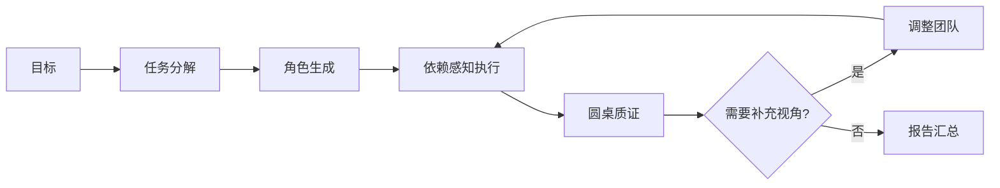

# Genesis Hive

### 一个目标，多个视角，一场有记录的讨论。


Python · FastAPI · LangGraph · React · 多模型协作 · Apache-2.0

[快速开始](#快速开始) · [五层引擎](#五层引擎) · [代码审查](docs/code-review.md) · [运行参考](docs/usage.md)

面向开放问题分析的多 Agent 原型。系统从自然语言目标拆出子任务，为不同角色配置模型与分析框架，执行后进行质疑、回应和共识判断；发现知识缺口时调整团队，再汇总报告。

## 五层引擎

| 引擎 | 职责 |
|---|---|
| Decomposer | 把目标拆为带依赖的任务图 |
| Spawner | 生成角色、模型选择、提示词与工具配置 |
| Executor | 并行执行无依赖任务、等待前置结果 |
| Council | 消息交换、独立裁判、压缩轮次上下文 |
| Evolver | 按缺口调整团队，复用未变化角色的结果 |



OpenRouter 统一模型调用；模型角色由环境变量选择。不同角色提供分析视角，不能据此断言消除了模型偏差或提高了准确率。

## 快速开始

```sh
git clone https://github.com/luxiaoyu0731/genesis-hive.git
cd genesis-hive
python3 -m venv .venv
.venv/bin/pip install -r backend/requirements.txt
cp .env.example .env
```

填写 OpenRouter 密钥和模型角色配置，然后启动本地服务：

```sh
.venv/bin/uvicorn backend.main:app --host 127.0.0.1 --port 8000
# 另一终端
cd frontend
npm ci
npm run dev
```

开发 API 包括 `/api/run`、`/api/status`、`/api/report` 与 `/ws`。模型执行会消耗接口额度；本次仓库审查未调用付费接口。

## 验证与边界

```sh
# 无网络的 JSON 输出契约测试
python3 -B -m unittest discover -s tests -v
# 环境完整时运行模拟执行测试
.venv/bin/python test_executor_mock.py
# 前端构建
cd frontend && npm run build
```

这是单进程原型，运行状态存内存；当前启动入口的并发任务占位仍有竞态风险，token 配置不是经过验证的严格 HTTP 计费上限。搜索、浏览器和代码执行工具存在骨架实现，不能当作完整可用能力。详见[审查记录](docs/code-review.md)。

服务没有面向公网的身份认证，应仅在可信本地环境运行。网络请求与提示词中的资料可能发送给配置的模型服务。

原创代码采用 [Apache-2.0](LICENSE)，依赖保留各自许可。[素材说明](docs/media/README.md)。
