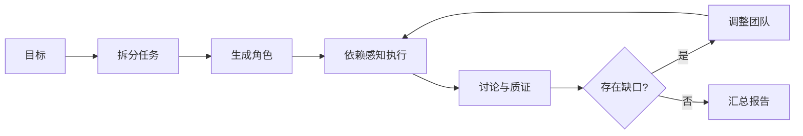

# Genesis Hive

[English](README.en.md)

给探索多 Agent 协作的开发者：把一个目标拆成角色与任务，通过并行分析、圆桌质证和团队调整形成汇总报告。


Python · FastAPI · LangGraph · React · Apache-2.0


演示说明：实际网页录屏；五个阶段均为静态示例，不是实时模型运行。

## 如何工作



角色使用不同模型与分析框架；裁判判断共识，轮次摘要控制上下文，团队变化后复用未变化角色的结果。

## 免密钥体验

```sh
git clone https://github.com/luxiaoyu0731/genesis-hive.git
cd genesis-hive/frontend
npm ci
npm run dev
```

网页展示固定示例，可切换五个阶段；不调用模型、不产生费用。当前网页尚未接入后端目标提交。

## 后端引擎运行

建议使用 Python 3.11+；前端需要 Node.js 22.12+，与 `frontend/package.json` 的要求一致。

```sh
git clone https://github.com/luxiaoyu0731/genesis-hive.git
cd genesis-hive
python3 -m venv .venv
.venv/bin/pip install -r backend/requirements.txt
cp .env.example .env
```

填写 OpenRouter 密钥与角色模型配置，分别启动后端和前端：

```sh
.venv/bin/uvicorn backend.main:app --host 127.0.0.1 --port 8000
```

```sh
cd frontend
npm ci
npm run dev
```

按操作指南调用 REST API 发起运行。模型调用会产生供应商费用，输入内容可能发送给相应模型服务。[操作指南](docs/usage.md)。

<details>
<summary>开发与使用边界</summary>

五层引擎位于 `backend/engines/`，前端位于 `frontend/`。

```sh
python3 -B -m unittest discover -s tests -v
# 完整开发环境中运行离线执行器模拟
.venv/bin/python test_executor_mock.py
```

目前为单进程本地原型，状态保存在内存，无公网认证；工具适配仍有骨架实现，预算并非严格 HTTP 计费上限。异构角色不等于已证明准确率提升。详见 [代码审查](docs/code-review.md)。

[贡献指南](CONTRIBUTING.md) · [安全反馈](SECURITY.md)

</details>

[Apache-2.0](LICENSE) · [素材说明](docs/media/README.md)

[遇到问题](https://github.com/luxiaoyu0731/genesis-hive/issues/new?template=bug_report.yml) · [告诉我们哪一步不清楚](https://github.com/luxiaoyu0731/genesis-hive/issues/new?template=first_use.yml) · [从小任务参与](CONTRIBUTING.md)
